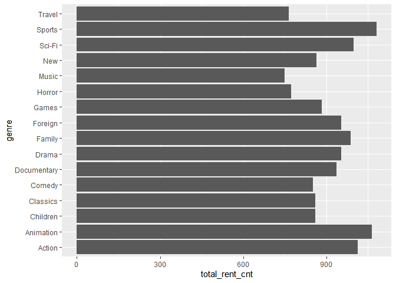
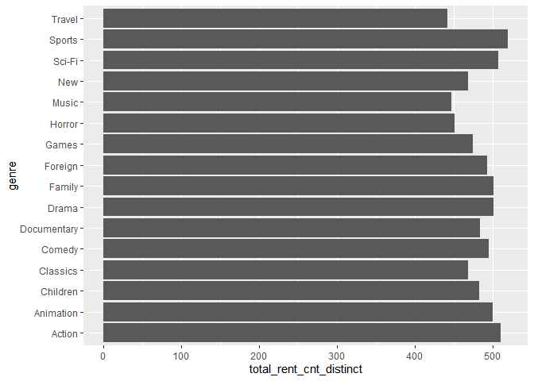
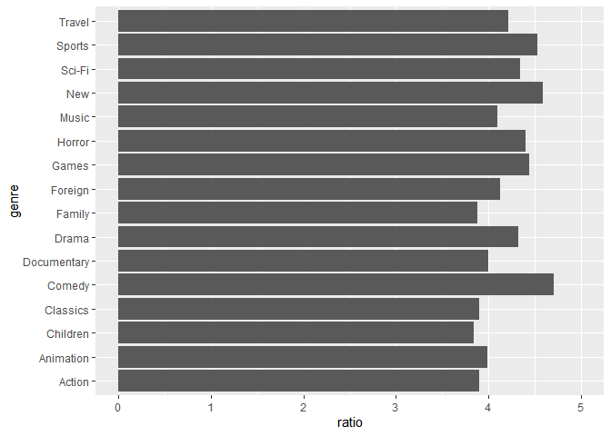
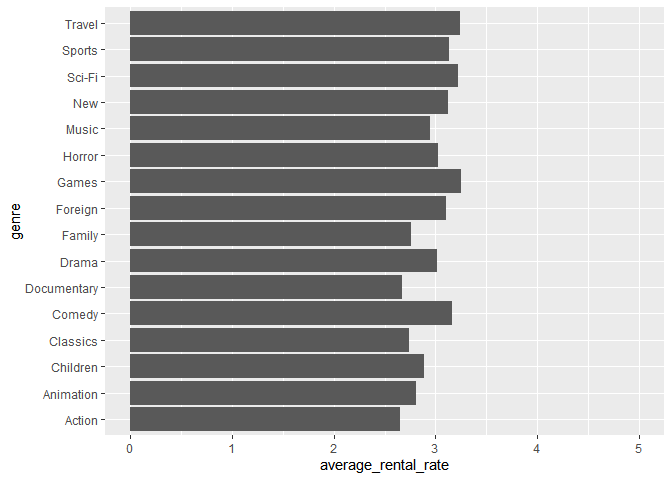
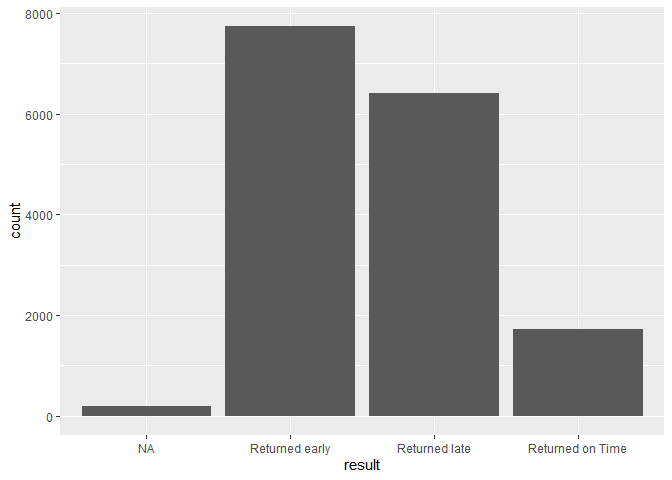
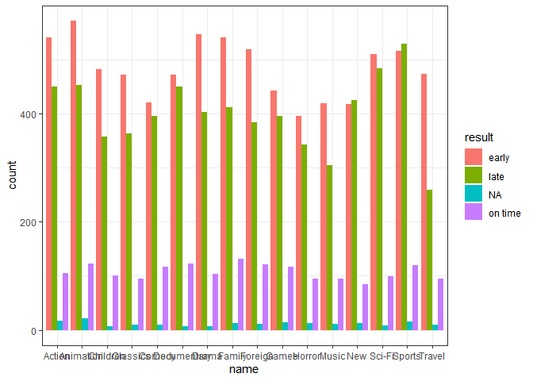
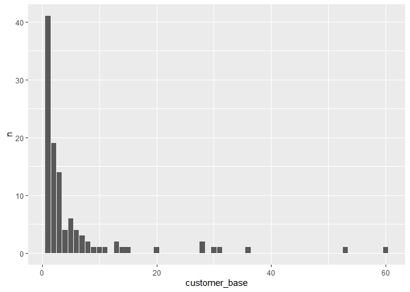

2019-2 데이터공학 SQL 과제
================

응용통계학과 2016122025 박지원

## \>\> Connect to PostgreSQL server

``` r
## SQL 서버와 연동하기 위한 라이브러리 설치
# install.packages("RPostgreSQL")
# install.packages("DBI")

## 설치한 라이브러리 불러오기
library(RPostgreSQL)
```

    ## Loading required package: DBI

``` r
library(DBI)

## connect
pgdrv <- dbDriver("PostgreSQL")

conn <- dbConnect(pgdrv, dbname = 'dvdrental', port = '5432',
                  user = 'postgres', password = 951204,
                  host = 'localhost')
```

위와 같이 RPostgreSQL과 DBI 라이브러리를 설치한 뒤, dbDriver를 통해 드라이버를 생성하고 dbConnect로
로컬 디비 서버에 연결하면 R에서 PostgreSQL를 사용할 수 있다.(비밀번호는 보안상의 이유로 임의의 숫자로
변경하였다.) R에서 SQL 쿼리를 넘겨 결과값을 받기 위해서는 dbGetQuery 함수를 활용하면 된다.
아래의 코드는 actor table의 데이터 상위 10개를 가져오는 예시 코드이다.

``` r
actor <- dbGetQuery(conn, "SELECT * FROM actor limit 10")
actor
```

    ##    actor_id first_name    last_name         last_update
    ## 1         1   Penelope      Guiness 2013-05-26 14:47:57
    ## 2         2       Nick     Wahlberg 2013-05-26 14:47:57
    ## 3         3         Ed        Chase 2013-05-26 14:47:57
    ## 4         4   Jennifer        Davis 2013-05-26 14:47:57
    ## 5         5     Johnny Lollobrigida 2013-05-26 14:47:57
    ## 6         6      Bette    Nicholson 2013-05-26 14:47:57
    ## 7         7      Grace       Mostel 2013-05-26 14:47:57
    ## 8         8    Matthew    Johansson 2013-05-26 14:47:57
    ## 9         9        Joe        Swank 2013-05-26 14:47:57
    ## 10       10  Christian        Gable 2013-05-26 14:47:57

## \>\> About DVD rental Data

과제를 위해 사용할 data는 [DVD rental
data](http://www.postgresqltutorial.com/postgresql-sample-database/)이다.
위 data는 dvd rental 가게의 비즈니스 프로세스를 나타내는 15개의 테이블을 포함하고 있다. 각 테이블의 이름과
내용, ER diagram은 아래와 같다.

    - actor : stores actors data including first name and last name.
    - film : stores films data such as title, release year, length, rating, etc.
    - film_actor : stores the relationships between films and actors.
    - category : stores film’s categories data.
    - film_category : stores the relationships between films and categories.
    - store : contains the store data including manager staff and address.
    - inventory : stores inventory data.
    - rental : stores rental data.
    - payment : stores customer’s payments.
    - staff : stores staff data.
    - customer : stores customers data.
    - address : stores address data for staff and customers
    - city : stores the city names.
    - country : stores the country names.


## \>\> Solve Questions Using SQL

### \[\[ Question 1 \]\]

**What are the top and least rented (in-demand) genres and what are
their total sales?**

``` r
query1 <- "(SELECT cat.name as genre, COUNT(cu.customer_id) AS total_rent_cnt, SUM(p.amount) AS total_sale 
          FROM payment p
          INNER JOIN rental r ON p.rental_id = r.rental_id
          INNER JOIN inventory i ON i.inventory_id = r.inventory_id
          INNER JOIN film_category fc ON fc.film_id = i.film_id
          INNER JOIN category cat ON cat.category_id = fc.category_id
          INNER JOIN customer cu ON r.customer_id = cu.customer_id
          GROUP BY cat.name
          ORDER BY total_rent_cnt DESC LIMIT 1)
          UNION ALL
              (SELECT cat.name as genre, COUNT(cu.customer_id) AS total_rent_cnt, SUM(p.amount) AS total_sale 
          FROM payment p
          INNER JOIN rental r ON p.rental_id = r.rental_id
          INNER JOIN inventory i ON i.inventory_id = r.inventory_id
          INNER JOIN film_category fc ON fc.film_id = i.film_id
          INNER JOIN category cat ON cat.category_id = fc.category_id
          INNER JOIN customer cu ON r.customer_id = cu.customer_id
          GROUP BY cat.name
          ORDER BY total_rent_cnt ASC LIMIT 1);"

result1 <- dbGetQuery(conn, query1)
result1
```

    ##    genre total_rent_cnt total_sale
    ## 1 Sports           1081    4892.19
    ## 2  Music            750    3071.52

가장 많이 빌린 dvd의 장르는 1081번의 대여가 기록된 “Sports”이고, 가장 적게 빌린 dvd의 장르는 750번의 대여가
기록된 “Music”이다. 위 쿼리는 UNION ALL을 기준으로 같은 형식으로 되어있는데, 처음의 select문은
total\_rent\_cnt를 기준으로 내림차순 정렬하여 나타나는 첫 번째 row를 반환하고 나중의 select문은
total\_rent\_cnt를 기준으로 오름차순 정렬하여 나타나는 첫 번째 row를 반환하여 top과 least를 뽑은 것이다.

전체 장르의 total\_rent\_cnt와 total\_sale을 확인할 수 있는 코드는 아래와 같다.

``` r
query1_total <- "SELECT cat.name as genre, COUNT(cu.customer_id) AS total_rent_cnt, 
                  SUM(p.amount) AS total_sale 
                FROM payment p
                INNER JOIN rental r ON p.rental_id = r.rental_id
                INNER JOIN inventory i ON i.inventory_id = r.inventory_id
                INNER JOIN film_category fc ON fc.film_id = i.film_id
                INNER JOIN category cat ON cat.category_id = fc.category_id
                INNER JOIN customer cu ON r.customer_id = cu.customer_id
                GROUP BY cat.name
                ORDER BY total_rent_cnt DESC;"
result1_total <- dbGetQuery(conn, query1_total)
result1_total
```

    ##          genre total_rent_cnt total_sale
    ## 1       Sports           1081    4892.19
    ## 2    Animation           1065    4245.31
    ## 3       Action           1013    3951.84
    ## 4       Sci-Fi            998    4336.01
    ## 5       Family            988    3830.15
    ## 6      Foreign            953    3934.47
    ## 7        Drama            953    4118.46
    ## 8  Documentary            937    3749.65
    ## 9        Games            884    3922.18
    ## 10         New            864    3966.38
    ## 11    Children            861    3309.39
    ## 12    Classics            860    3353.38
    ## 13      Comedy            851    4002.48
    ## 14      Horror            773    3401.27
    ## 15      Travel            765    3227.36
    ## 16       Music            750    3071.52

위 결과를 barplot을 통해 시각화 할 수 있다.

``` r
library(ggplot2)
ggplot(result1_total, aes(genre, total_rent_cnt))+geom_bar(stat='identity')+coord_flip() 
```

<!-- -->

그렇다면 한 번 대여할 때의 가격은 장르별로 차이가 있을까?

``` r
library(tidyverse)
```

    ## -- Attaching packages --------------------------------------------------------------------------------------- tidyverse 1.2.1 --

    ## √ tibble  2.1.3     √ purrr   0.3.2
    ## √ tidyr   1.0.0     √ dplyr   0.8.3
    ## √ readr   1.3.1     √ stringr 1.4.0
    ## √ tibble  2.1.3     √ forcats 0.4.0

    ## -- Conflicts ------------------------------------------------------------------------------------------ tidyverse_conflicts() --
    ## x dplyr::filter() masks stats::filter()
    ## x dplyr::lag()    masks stats::lag()

``` r
find_ratio <- mutate(result1_total, ratio = total_sale / total_rent_cnt)
find_ratio <- find_ratio[c(order(-find_ratio$ratio)),]
find_ratio
```

    ##          genre total_rent_cnt total_sale    ratio
    ## 13      Comedy            851    4002.48 4.703267
    ## 10         New            864    3966.38 4.590718
    ## 1       Sports           1081    4892.19 4.525615
    ## 9        Games            884    3922.18 4.436855
    ## 14      Horror            773    3401.27 4.400091
    ## 4       Sci-Fi            998    4336.01 4.344699
    ## 7        Drama            953    4118.46 4.321574
    ## 15      Travel            765    3227.36 4.218771
    ## 6      Foreign            953    3934.47 4.128510
    ## 16       Music            750    3071.52 4.095360
    ## 8  Documentary            937    3749.65 4.001761
    ## 2    Animation           1065    4245.31 3.986207
    ## 3       Action           1013    3951.84 3.901125
    ## 12    Classics            860    3353.38 3.899279
    ## 5       Family            988    3830.15 3.876670
    ## 11    Children            861    3309.39 3.843659

total sale에서 total\_rent\_cnt를 나누어 한 번 대여시 평균적인 가격을 ratio라는 컬럼에 나타냈을 때의
결과는 위와 같다. Comedy 장르가 약 4.7로 가장 비쌌고, Children 장르가 약 3.84로 가장 저렴했다.
Sports와 Music을 비교했을 때 Sports가 조금 더 비쌌고, 둘의 차이는 약 0.43정도임을 확인할 수 있다.

### \[\[ Question 2 \]\]

**Can we know how many distinct users have rented each genre?**

아래의 코드를 통해 각 장르를 몇 명의 distinct한 손님이 대여했는지를 확인할 수 있다.

``` r
query2 <- "SELECT cat.name AS genre, count(DISTINCT r.customer_id) AS total_rent_cnt_distinct
          FROM category cat
          INNER JOIN film_category fc ON cat.category_id = fc.category_id
          INNER JOIN inventory i ON i.film_id = fc.film_id
          INNER JOIN rental r ON r.inventory_id = i.inventory_id
          GROUP BY cat.name
          ORDER BY total_rent_cnt_distinct DESC;"
result2 <- dbGetQuery(conn, query2)
result2
```

    ##          genre total_rent_cnt_distinct
    ## 1       Sports                     519
    ## 2       Action                     510
    ## 3       Sci-Fi                     507
    ## 4       Family                     501
    ## 5        Drama                     501
    ## 6    Animation                     500
    ## 7       Comedy                     495
    ## 8      Foreign                     493
    ## 9  Documentary                     483
    ## 10    Children                     482
    ## 11       Games                     474
    ## 12         New                     468
    ## 13    Classics                     468
    ## 14      Horror                     451
    ## 15       Music                     447
    ## 16      Travel                     442

1번 문제에서 확인한 결과는 한 명의 user가 같은 장르의 dvd를 여러 번 대여하면, 대여한 횟수대로 count가 되었지만,
이 문제에서는 한 명의 user가 같은 장르의 dvd를 아무리 여러 번 대여를 했다고 하더라도 count가 단 1만 증가하게
된다. 하지만 순위에는 그렇게 큰 차이가 보이지 않는다. 여전히 가장 많은 사람들이 대여한 장르는 Sports이고,
Music의 순위는 단 한 계단 상승했을 뿐이다.

``` r
ggplot(result2, aes(genre, total_rent_cnt_distinct))+geom_bar(stat='identity')+coord_flip() 
```

<!-- -->

bargraph에도 나와있듯, 1번 문제에서 최하위였던 Music이 한 계단 상승하기는 했지만, 최하위인 Travel과의 차이는
미미하다. 하지만 Travel과 Music을 비교하자면 Travel 장르는 더 적은 사람이 대여하기는 하나, 그들의
Travel 장르 dvd의 재대여가 많음을 알 수 있다.

``` r
revisit <- inner_join(result1_total, result2)
```

    ## Joining, by = "genre"

``` r
revisit_ratio <- mutate(revisit, ratio = total_sale / total_rent_cnt)
revisit_ratio <- revisit_ratio[c(order(-revisit_ratio$ratio)),]
revisit_ratio
```

    ##          genre total_rent_cnt total_sale total_rent_cnt_distinct    ratio
    ## 13      Comedy            851    4002.48                     495 4.703267
    ## 10         New            864    3966.38                     468 4.590718
    ## 1       Sports           1081    4892.19                     519 4.525615
    ## 9        Games            884    3922.18                     474 4.436855
    ## 14      Horror            773    3401.27                     451 4.400091
    ## 4       Sci-Fi            998    4336.01                     507 4.344699
    ## 7        Drama            953    4118.46                     501 4.321574
    ## 15      Travel            765    3227.36                     442 4.218771
    ## 6      Foreign            953    3934.47                     493 4.128510
    ## 16       Music            750    3071.52                     447 4.095360
    ## 8  Documentary            937    3749.65                     483 4.001761
    ## 2    Animation           1065    4245.31                     500 3.986207
    ## 3       Action           1013    3951.84                     510 3.901125
    ## 12    Classics            860    3353.38                     468 3.899279
    ## 5       Family            988    3830.15                     501 3.876670
    ## 11    Children            861    3309.39                     482 3.843659

전체 대여 횟수에서 distinct customer의 대여 횟수를 나누어 동일 customer의 재대여 수치를 대략적으로
확인해보려 한다. Comedy, New, Sports, Games, Horror 장르에서 재대여가 많이
일어나며, 위에서 확인한 바와 같이 Travel이 Music보다 재대여가 더 많음을 알 수 있다.

### \[\[ Question 3 \]\]

**What is the average rental rate for each genre? (from the highest to
the lowest)**

``` r
query3 <- "SELECT cat.name as genre, ROUND(AVG(f.rental_rate),2) AS average_rental_rate 
          FROM category cat
          INNER JOIN film_category fc ON cat.category_id = fc.category_id 
          INNER JOIN film f ON f.film_id = fc.film_id 
          GROUP BY genre
          ORDER BY average_rental_rate DESC;"
result3 <- dbGetQuery(conn, query3)
result3
```

    ##          genre average_rental_rate
    ## 1        Games                3.25
    ## 2       Travel                3.24
    ## 3       Sci-Fi                3.22
    ## 4       Comedy                3.16
    ## 5       Sports                3.13
    ## 6          New                3.12
    ## 7      Foreign                3.10
    ## 8       Horror                3.03
    ## 9        Drama                3.02
    ## 10       Music                2.95
    ## 11    Children                2.89
    ## 12   Animation                2.81
    ## 13      Family                2.76
    ## 14    Classics                2.74
    ## 15 Documentary                2.67
    ## 16      Action                2.65

1번 문제에서 간단하게 분석한 것을 3번을 통해 더 구체적으로 확인할 수 있다. 1번에서 ratio를 통해 각 장르를 한 번
대여할 때 평균적으로 얼마를 지불하는지를 알아봤다면, 이 문제에서는 각 장르에 포함된 전체 film에 대해 평균적인
대여 가격을 알아본다.

다시 한 번 Sports와 Music의 성향을 확인해보자. Sports 장르는 평균 대여 비용이 3.13으로 상위 5번째에
rank 되어있다. Music은 2.95로 상위 10번째에 rank되어있다. 1번에서 확인한 것과 마찬가지로 Music의 대여
비용이 Sports보다 저렴함에도 불구하고 더 많은 사람이 더 여러번 Sports 장르의 dvd를 대여하고 있다. 이
데이터를 제공한 dvd store를 방문하는 고객은 주로 Sports 장르를 좋아하는 사람들이 많을 것임을 예측할 수
있다.

Action 장르는 가격이 가장 저렴한만큼 전체 대여 수에서는 상위 3등, distinct한 user의 대여 수에서는 상위 2등을
기록하였다. 반면 Music 장르는 가격이 Action과 약 0.3만큼밖에 차이가 나지 않을만큼 저렴하고 가격경쟁력이 있음에도
불구하고 많이 대여되지 않았다. dvd를 대여함에 있어 장르 그 자체가 가격보다 더 중요한 요인이 됨을 알 수 있다.

1번과 3번에서 각각 확인한 장르별 평균 대여 비용을 비교해보자.

``` r
compare_avg_rate <- inner_join(find_ratio, result3)
```

    ## Joining, by = "genre"

``` r
compare_avg_rate
```

    ##          genre total_rent_cnt total_sale    ratio average_rental_rate
    ## 1       Comedy            851    4002.48 4.703267                3.16
    ## 2          New            864    3966.38 4.590718                3.12
    ## 3       Sports           1081    4892.19 4.525615                3.13
    ## 4        Games            884    3922.18 4.436855                3.25
    ## 5       Horror            773    3401.27 4.400091                3.03
    ## 6       Sci-Fi            998    4336.01 4.344699                3.22
    ## 7        Drama            953    4118.46 4.321574                3.02
    ## 8       Travel            765    3227.36 4.218771                3.24
    ## 9      Foreign            953    3934.47 4.128510                3.10
    ## 10       Music            750    3071.52 4.095360                2.95
    ## 11 Documentary            937    3749.65 4.001761                2.67
    ## 12   Animation           1065    4245.31 3.986207                2.81
    ## 13      Action           1013    3951.84 3.901125                2.65
    ## 14    Classics            860    3353.38 3.899279                2.74
    ## 15      Family            988    3830.15 3.876670                2.76
    ## 16    Children            861    3309.39 3.843659                2.89

``` r
ggplot(compare_avg_rate, aes(genre, ratio))+geom_bar(stat = "identity")+ylim(0,5)+coord_flip()
```

<!-- -->

``` r
ggplot(compare_avg_rate, aes(genre, average_rental_rate))+geom_bar(stat = "identity")+ylim(0,5)+coord_flip()
```

<!-- -->

ratio는 대여한 이력이 있는 dvd를 가지고 가격의 평균을 낸 값이고, average\_rental\_rate는 대여 이력과
상관 없이 store가 보유하고 있는 모든 dvd 가격의 평균을 낸 것이다. 이 때 ratio가 수치가 항상 높은 것은
상대적으로 인기가 없거나 발매가 매우 오래되어 가격이 싼 dvd는 덜 빌리고, 가격은 비싸지만 인기가 많고 최신인
dvd가 많이 대여되기 때문이지 않을까 추측한다.

### \[\[ Question 4 \]\]

**How many rented films were returned late, early, and on time?**

``` r
query4 <- "SELECT x1.result, COUNT(x1.result) FROM (
            SELECT (
                CASE
                WHEN res.rental_duration > res.bw THEN 'Returned early'
                    WHEN res.rental_duration = res.bw THEN 'Returned on Time'
                    WHEN res.rental_duration < res.bw THEN 'Returned late'
                    ELSE 'NA'
                END) AS result
            FROM (SELECT x.* 
                FROM (
                    SELECT f.film_id, f.rental_duration, DATE_PART('day',r.return_date - r.rental_date) AS bw 
                    FROM rental r 
                    INNER JOIN inventory i ON i.inventory_id = r.inventory_id 
                    INNER JOIN film f ON f.film_id = i.film_id
                ) x
            ) res
          ) x1
          GROUP BY x1.result
          ORDER BY x1.count DESC;"
result4 <- dbGetQuery(conn, query4)
result4
```

    ##             result count
    ## 1   Returned early  7738
    ## 2    Returned late  6403
    ## 3 Returned on Time  1720
    ## 4               NA   183

``` r
ggplot(result4, aes(result, count))+geom_bar(stat = "identity")
```

<!-- -->

반납 날짜보다 일찍 반납된 dvd가 7738 건으로 전체 건수의 약 48%를 차지했고, 늦게 반납된 dvd는 6403건으로 약
40%, 제 날짜에 반납된 dvd는 1720건으로 약 11%, NA 값이 183건으로 약 0.01%를 차지했다. 늦게 반납된
dvd가 매우 큰 비중을 차지한다는 점이 눈여겨볼만하다.

카테고리 별로 반납 유형에 차이가 있을까?

``` r
query4_by_cat = "SELECT name, result, count(result) FROM (
              SELECT (
                    CASE
                    WHEN res.rental_duration > res.bw THEN 'early'
                        WHEN res.rental_duration = res.bw THEN 'on time'
                        WHEN res.rental_duration < res.bw THEN 'late'
                        ELSE 'NA'
                    END) AS result, res.*
                FROM (SELECT x.* 
                    FROM (
                        SELECT f.film_id, f.rental_duration, c.name, DATE_PART('day',r.return_date - r.rental_date) AS bw 
                        FROM rental r 
                        INNER JOIN inventory i ON i.inventory_id = r.inventory_id 
                        INNER JOIN film f ON f.film_id = i.film_id
                        INNER JOIN film_category fc ON f.film_id = fc.film_id
                        INNER JOIN category c ON c.category_id = fc.category_id
                    ) x
                ) res ) tmp
              GROUP BY name, result
              ORDER BY name, result;"
result4_by_cat <- dbGetQuery(conn, query4_by_cat)
result4_by_cat
```

    ##           name  result count
    ## 1       Action   early   541
    ## 2       Action    late   449
    ## 3       Action      NA    17
    ## 4       Action on time   105
    ## 5    Animation   early   571
    ## 6    Animation    late   452
    ## 7    Animation      NA    21
    ## 8    Animation on time   122
    ## 9     Children   early   482
    ## 10    Children    late   357
    ## 11    Children      NA     6
    ## 12    Children on time   100
    ## 13    Classics   early   472
    ## 14    Classics    late   363
    ## 15    Classics      NA     9
    ## 16    Classics on time    95
    ## 17      Comedy   early   420
    ## 18      Comedy    late   396
    ## 19      Comedy      NA     9
    ## 20      Comedy on time   116
    ## 21 Documentary   early   472
    ## 22 Documentary    late   449
    ## 23 Documentary      NA     7
    ## 24 Documentary on time   122
    ## 25       Drama   early   547
    ## 26       Drama    late   403
    ## 27       Drama      NA     7
    ## 28       Drama on time   103
    ## 29      Family   early   540
    ## 30      Family    late   411
    ## 31      Family      NA    13
    ## 32      Family on time   132
    ## 33     Foreign   early   518
    ## 34     Foreign    late   383
    ## 35     Foreign      NA    11
    ## 36     Foreign on time   121
    ## 37       Games   early   443
    ## 38       Games    late   396
    ## 39       Games      NA    14
    ## 40       Games on time   116
    ## 41      Horror   early   396
    ## 42      Horror    late   343
    ## 43      Horror      NA    12
    ## 44      Horror on time    95
    ## 45       Music   early   419
    ## 46       Music    late   305
    ## 47       Music      NA    11
    ## 48       Music on time    95
    ## 49         New   early   418
    ## 50         New    late   424
    ## 51         New      NA    13
    ## 52         New on time    85
    ## 53      Sci-Fi   early   510
    ## 54      Sci-Fi    late   484
    ## 55      Sci-Fi      NA     8
    ## 56      Sci-Fi on time    99
    ## 57      Sports   early   516
    ## 58      Sports    late   529
    ## 59      Sports      NA    15
    ## 60      Sports on time   119
    ## 61      Travel   early   473
    ## 62      Travel    late   259
    ## 63      Travel      NA    10
    ## 64      Travel on time    95

``` r
ggplot(result4_by_cat, aes(x=name, y=count, fill = result))+ 
  geom_bar(stat = "identity", position = "dodge")+ 
  theme_bw()
```

<!-- -->

대부분의 카테고리가 일찍 반납되는 경우가 가장 많고 그 다음이 늦게 반납, 마지막이 당일 반납의 순서로 이루어져있다. 하지만
New와 Sports 카테고리의 경우에는 오히려 늦게 반납하는 경우가 가장 많았다. customer의 장르별 반납 유형을 확인하고
각 장르별로 다르게 요금을 부과하는 정책을 만들 수 있을 것이라고 생각한다.

이 결과에서 또 하나 눈여겨봐야 할 것은 NA 값이 존재한다는 것이다.

``` r
query4_na = "SELECT (
                    CASE
                    WHEN res.rental_duration > res.bw THEN 'early'
                        WHEN res.rental_duration = res.bw THEN 'on time'
                        WHEN res.rental_duration < res.bw THEN 'late'
                        ELSE 'NA'
                    END) AS result, res.*
                FROM (SELECT x.* 
                    FROM (
                        SELECT f.film_id, f.rental_duration, c.name, DATE_PART('day',r.return_date - r.rental_date) AS bw 
                        FROM rental r 
                        INNER JOIN inventory i ON i.inventory_id = r.inventory_id 
                        INNER JOIN film f ON f.film_id = i.film_id
                        INNER JOIN film_category fc ON f.film_id = fc.film_id
                        INNER JOIN category c ON c.category_id = fc.category_id
                    ) x
                ) res;"
result4_na <- dbGetQuery(conn, query4_na)
result4_na <- filter(result4_na, result == 'NA')
head(result4_na)
```

    ##   result film_id rental_duration     name bw
    ## 1     NA     445               5 Classics NA
    ## 2     NA     440               6  Foreign NA
    ## 3     NA     341               5 Classics NA
    ## 4     NA     338               6   Sci-Fi NA
    ## 5     NA     893               4   Sci-Fi NA
    ## 6     NA     178               6   Comedy NA

NA 값은 위의 결과처럼 bw, 즉 반납 날짜에서 대여 날짜를 뺀 기간이 존재하지 않을 때 생긴다. 두 날짜 중 하나라도 제대로
기록 되지 않은 경우 빈 값으로 채워지게 되는 것이다.

### \[\[ Question 5 \]\]

**In which countries does Rent A Film have a presence and what is the
customer base in each country? What are the total sales in each country?
(from most to least)**

``` r
query5 <- "SELECT c.country, COUNT(DISTINCT cus.customer_id) AS customer_base, SUM(p.amount) AS total_sale 
          FROM customer cus 
          INNER JOIN address a ON cus.address_id = a.address_id
          INNER JOIN city ct ON a.city_id = ct.city_id
          INNER JOIN country c ON ct.country_id = c.country_id
          INNER JOIN payment p ON p.customer_id = cus.customer_id
          GROUP BY c.country
          ORDER BY total_sale DESC;"
result5 <- dbGetQuery(conn, query5)
head(result5)
```

    ##         country customer_base total_sale
    ## 1         India            60    6034.78
    ## 2         China            53    5251.03
    ## 3 United States            36    3685.31
    ## 4         Japan            31    3122.51
    ## 5        Mexico            30    2984.82
    ## 6        Brazil            28    2919.19

\_\_Rent A Film\_\_은 전 세계 108개국에 분포하고 있으며, 인도가 60개, 중국이 53개, 미국이 36개로 가장
많다.

각 나라에 있는 customer\_base의 개수의 분포를 살펴보자.

``` r
result5_cnt <- result5 %>% group_by(customer_base) %>% summarise(n = n())
result5_cnt
```

    ## # A tibble: 21 x 2
    ##    customer_base     n
    ##            <dbl> <int>
    ##  1             1    41
    ##  2             2    19
    ##  3             3    14
    ##  4             4     4
    ##  5             5     6
    ##  6             6     4
    ##  7             7     3
    ##  8             8     2
    ##  9             9     1
    ## 10            10     1
    ## # ... with 11 more rows

``` r
ggplot(result5_cnt, aes(customer_base, n))+geom_bar(stat = "identity")
```

<!-- -->

각 나라에 있는 customer\_base의 개수의 분포를 보니 한 나라에 지점 1개가 있는 곳이 41개로 가장 많았고, 그
다음은 2개와 3개이다. customer\_base의 개수가 가장 많았던 인도, 중국, 미국이 매우 특별한 case임을
알 수 있다.

``` r
query5_kor <- "SELECT c.country, COUNT(DISTINCT cus.customer_id) AS customer_base, SUM(p.amount) AS total_sale 
          FROM customer cus 
          INNER JOIN address a ON cus.address_id = a.address_id
          INNER JOIN city ct ON a.city_id = ct.city_id
          INNER JOIN country c ON ct.country_id = c.country_id
          INNER JOIN payment p ON p.customer_id = cus.customer_id
          GROUP BY c.country
          HAVING c.country = 'South Korea';"
result5_kor <- dbGetQuery(conn, query5_kor)
result5_kor
```

    ##       country customer_base total_sale
    ## 1 South Korea             5     527.77

한국에는 무려 5개의 지점이 있음을 HAVING 절을 통해 확인하였다.

### \[\[ Question 6 \]\]

**Who are the top 5 customers per total sales and can we get their
details just in case Rent A Film wants to reward them?**

``` r
query6 <- "WITH t1 AS (SELECT *, first_name || ' ' || last_name AS full_name FROM customer)
          SELECT full_name, email, address, phone, city, country, SUM(amount) AS total_purchase_in_currency
          FROM t1
          INNER JOIN address ON t1.address_id = address.address_id
          INNER JOIN city ON address.city_id = city.city_id
          INNER JOIN country ON city.country_id = country.country_id
          INNER JOIN payment ON t1.customer_id = payment.customer_id
          GROUP BY 1,2,3,4,5,6
          ORDER BY 7 DESC
          LIMIT 5;"
result6 <- dbGetQuery(conn, query6)
result6
```

    ##        full_name                             email               address
    ## 1   Eleanor Hunt   eleanor.hunt@sakilacustomer.org        1952 Pune Lane
    ## 2      Karl Seal      karl.seal@sakilacustomer.org      1427 Tabuk Place
    ## 3  Marion Snyder  marion.snyder@sakilacustomer.org 1891 Rizhao Boulevard
    ## 4 Rhonda Kennedy rhonda.kennedy@sakilacustomer.org     1749 Daxian Place
    ## 5     Clara Shaw     clara.shaw@sakilacustomer.org   1027 Songkhla Manor
    ##          phone                city       country
    ## 1 354615066969         Saint-Denis        Runion
    ## 2 214756839122          Cape Coral United States
    ## 3 391065549876 Santa Brbara dOeste        Brazil
    ## 4 963369996279           Apeldoorn   Netherlands
    ## 5 563660187896           Molodetno       Belarus
    ##   total_purchase_in_currency
    ## 1                     211.55
    ## 2                     208.58
    ## 3                     194.61
    ## 4                     191.62
    ## 5                     189.60

1등을 차지한 customer는 Runion에 거주하는 Eleanor Hunt이다. 5번 문제에서 미국 이외에 다른 나라들은 몇
개의 지점을 가지고 있는지 확인하지 못했으므로 1등부터 5등까지를 차지한 customer의 거주 나라에 각각 몇 개의 지점이
있는지 확인하려 한다.

``` r
query6_con <- "SELECT c.country, COUNT(DISTINCT cus.customer_id) AS customer_base
                , SUM(p.amount) AS total_sale
              FROM customer cus 
              INNER JOIN address a ON cus.address_id = a.address_id
              INNER JOIN city ct ON a.city_id = ct.city_id
              INNER JOIN country c ON ct.country_id = c.country_id
              INNER JOIN payment p ON p.customer_id = cus.customer_id
              GROUP BY c.country
              HAVING c.country in('Runion', 'United States', 'Brazil', 'Netherlands', 'Belarus')
              ORDER BY customer_base DESC;"
result6_con <- dbGetQuery(conn, query6_con)
result6_con
```

    ##         country customer_base total_sale
    ## 1 United States            36    3685.31
    ## 2        Brazil            28    2919.19
    ## 3   Netherlands             5     557.73
    ## 4       Belarus             2     271.36
    ## 5        Runion             1     211.55

Runion에는 단 한 개의 지점밖에 없음에도 불구하고 전 세계의 customer 중에서 가장 많이 dvd를 빌렸다는 것이 매우
놀랍다. 아마도 해당 customer의 거주지와 지점의 위치가 지리적으로 매우 가깝고, 그 customer의 취미가 dvd를
보는 것이거나, 해당 지역 주변에 dvd 대여 이외에 여가 생활을 즐길 다른 선택지가 많이 없을 것이라고 추측한다.

## \>\> Insights and Suggestions

위의 분석을 통해 \_\_Rent A Film\_\_의 대여 현황과 지점 분포 현황 등을 확인할 수 있었다. 이러한 분석을 통해
얻은 몇 가지의 insight를 제시하고 이를 활용하여 사업에 어떻게 활용할 수 있을지 제안한다.

**- Sports 장르 dvd 확보 :** Sports 장르는 store를 방문하는 소비자들이 가장 많이 찾는 장르이다. 가격이
조금 비싸더라도 그들의 취향에 더 잘 맞는 장르이기 때문에 가격과 상관없이 Sports dvd를 많이 선택하고 있다. 따라서
Sports 장르에 해당하는 최신버전의 인기 있는 dvd를 많이 확보하여 더 많은 사람들이 가게를 방문하고 더 많은 dvd를
대여하도록 해야한다.

**- 장르별 추가비용 부과 정책 :** 많은 테이블과 그래프에서 눈에 띄는 특징을 보였던 Sports 장르를 예를 들어
생각해보자. 이 장르는 dvd를 대여하는 사람도 많고, 그 소비자들이 또 같은 장르를 대여하는 등 순환이 매우
자주, 많이 일어나는 장르이다. 그런데 Sports 장르를 대여하고 늦게 반납하는 경우가 모든 카테고리 중 유일하게 일찍
반납하는 경우보다 많다. 따라서 이 장르에 대해서는 대여 기간을 넘겨서 반납할 시, 다른 장르보다 더 많은 부과금을
내는 등의 전략을 세울 수 있다.

**- 새로운 지점을 세우기 위한 사전 조사 :** 가장 많은 지불을 한 소비자가 단 하나의 지점이 있는 나라에 거주하는 것은
매우 눈여겨볼만하다. 위에서 그 지역의 특징을 추측하여 적었지만, Runion이나 Belarus와 같이 아주 적은 지점을
가지고 있음에도 한 소비자가 많은 소비를 한다면 그 지역에 특징이 있는지를 확인하고 비슷한 특징을 가진 나라와 지역에 새로운
지점을 내는 것도 좋은 비즈니스 전략이 될 수 있다.
